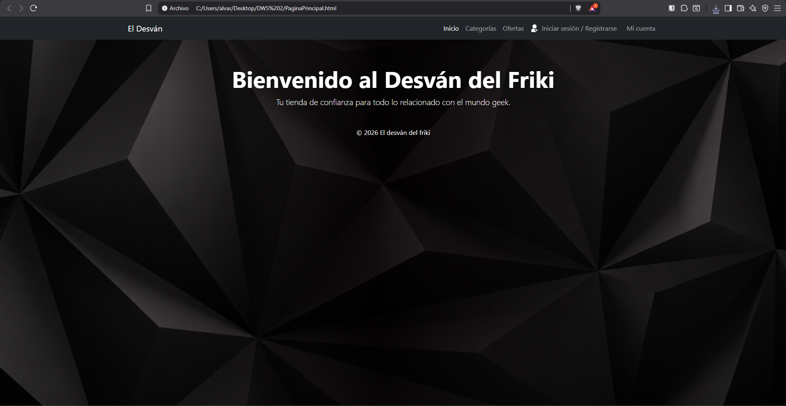
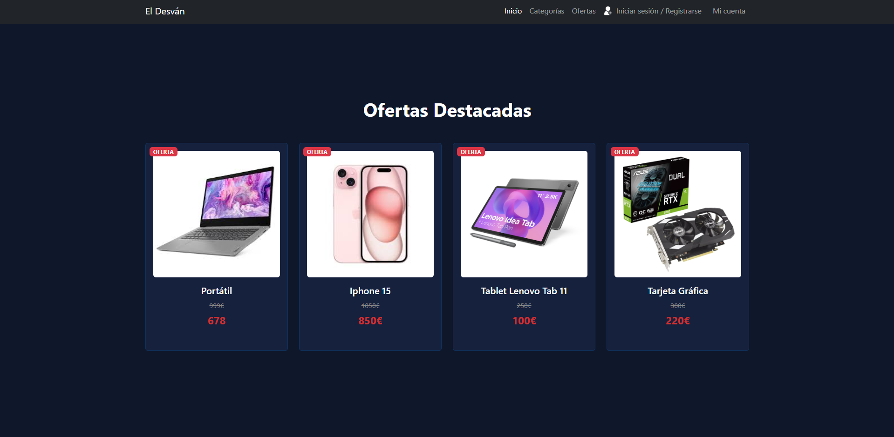
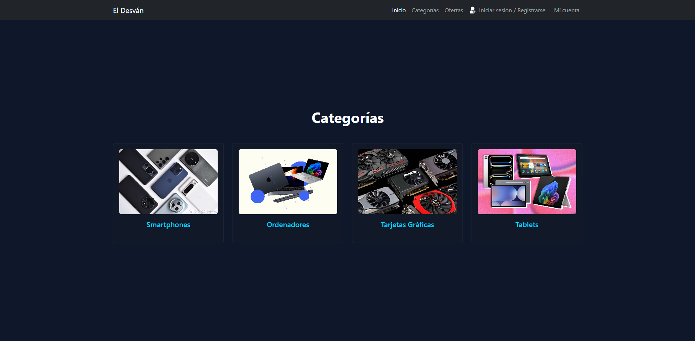
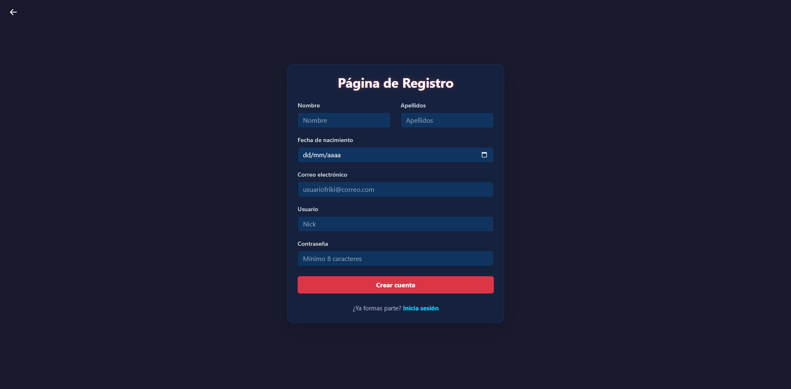
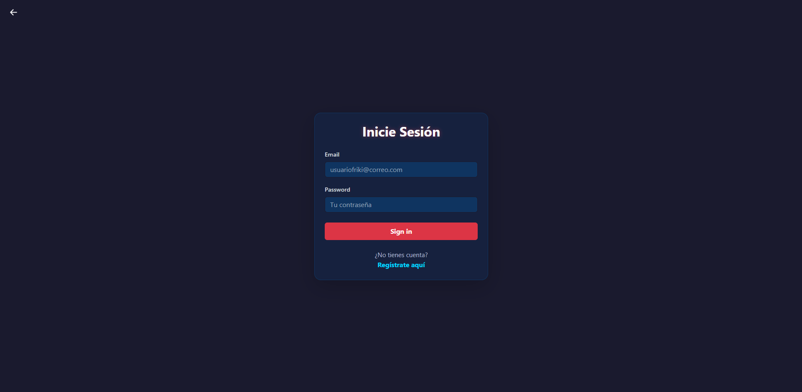
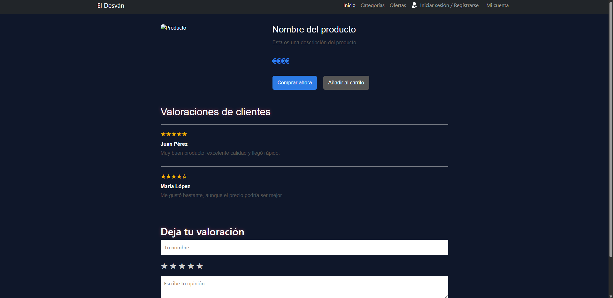
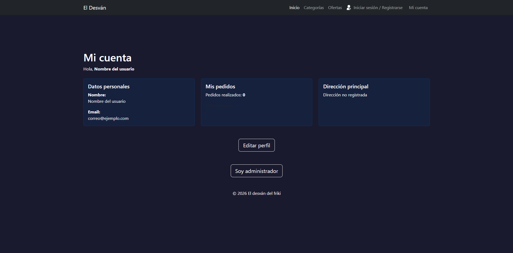
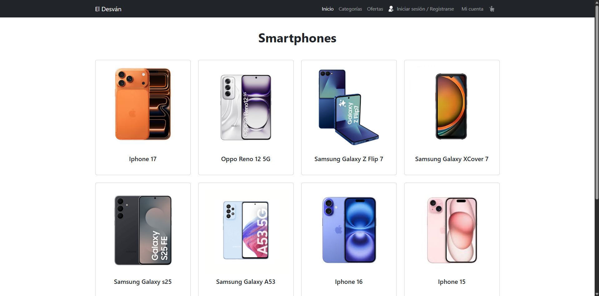
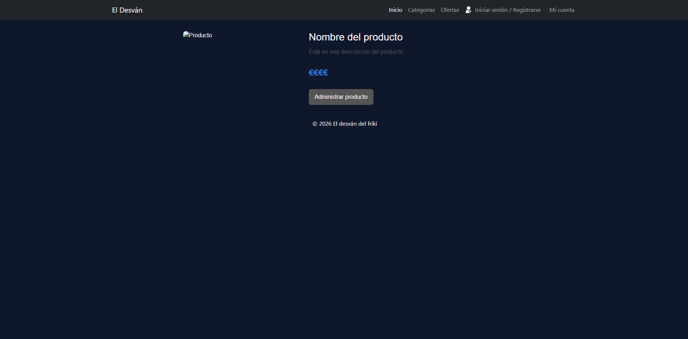
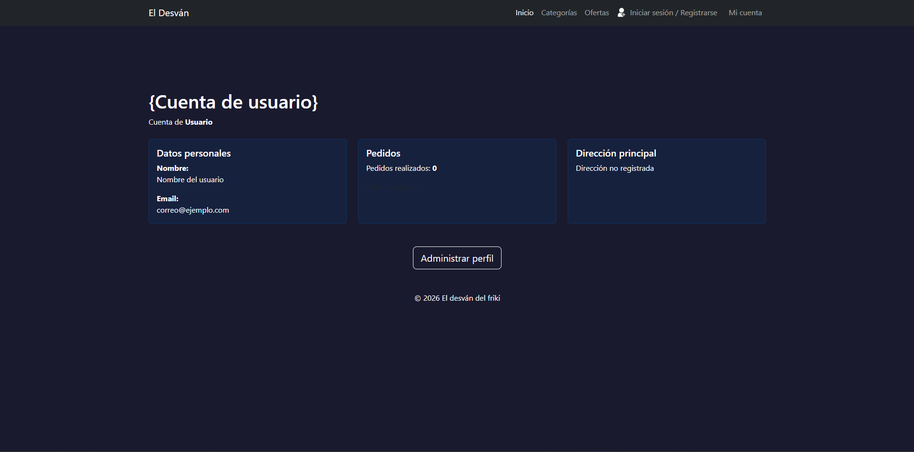

# El desván del friki

## 👥 Miembros del Equipo
| Nombre y Apellidos | Correo URJC | Usuario GitHub |
|:--- |:--- |:--- |
| Eduardo Soria Escobar | e.soria.2024@alumnos.urjc.es | Edu_05 |
| Álvaro Cuadrado García | a.cuadrado.2024@alumnos.urjc.es | Alvaro223 |
| Hugo García Tapia | h.garciat.2024@alumnos.urjc.es | hugogarciatapia |
| Claudio Rafael Horrillo Sicora | cr.horrillo.2024@alumnos.urjc.es | ClaudioURJC |

---

## 🎭 **Preparación: Definición del Proyecto**

### **Descripción del Tema**
Se trata de una tienda online de venta de componentes para ordenadores. Pertenece al sector tecnológico, más concretamente a la venta online. Proporciona al usuario componentes a precios competitivos para sus dispositivos.

### **Entidades**
Indicar las entidades principales que gestionará la aplicación y las relaciones entre ellas:

1. **[Entidad 1]**: Usuario
2. **[Entidad 2]**: Valoración
3. **[Entidad 3]**: Producto
4. **[Entidad 4]**: Pedido
5. **[Entidad 5]**: Categoría

**Relaciones entre entidades:**
- Usuario - Pedido: Un usuario puede tener múltiples pedidos (1:N)
- Pedido - Producto: Un pedido puede contener múltiples productos y un producto puede estar en múltiples pedidos (N:M)
- Producto - Categoría: Un producto pertenece a una categoría (N:1)
- Valoración - Producto: Un producto puede tener múltiples valoraciones (N:1).

### **Permisos de los Usuarios**
Describir los permisos de cada tipo de usuario e indicar de qué entidades es dueño:

* **Usuario Anónimo**: 
  - Permisos: Visualización de catálogo, búsqueda de productos, registro
  - No es dueño de ninguna entidad

* **Usuario Registrado**: 
  - Permisos: Gestión de perfil, realizar pedidos, crear valoraciones
  - Es dueño de: Sus propios Pedidos, su Perfil de Usuario, sus Valoraciones

* **Administrador**: 
  - Permisos: Gestión completa de productos (CRUD), moderación de contenido
  - Es dueño de: Productos, Categorías, puede gestionar todos los Pedidos y Usuarios

### **Imágenes**
Indicar qué entidades tendrán asociadas una o varias imágenes:

- **[Entidad con imágenes 1]**: Usuario - Una imagen de avatar por usuario
- **[Entidad con imágenes 2]**: Producto - Múltiples imágenes por producto (galería)
- **[Entidad con imágenes 3]**: Categoría - Una imagen representativa por categoría

---

## 🛠 **Práctica 1: Maquetación de páginas con HTML y CSS**

### **Vídeo de Demostración**
📹 **[Enlace al vídeo en YouTube](https://www.youtube.com/watch?v=x91MPoITQ3I)**
> Vídeo mostrando las principales funcionalidades de la aplicación web.

### **Diagrama de Navegación**
Diagrama que muestra cómo se navega entre las diferentes páginas de la aplicación:


> [Descripción opcional del flujo de navegación: Ej: "El usuario puede acceder desde la página principal a todas las secciones mediante el menú de navegación. Los usuarios anónimos solo tienen acceso a las páginas públicas, mientras que los registrados pueden acceder a su perfil y panel de usuario."]

### **Capturas de Pantalla y Descripción de Páginas**

#### **1. Página Principal / Home**


> Página de inicio con el nombre de la web y la barra de navegación entre las distintas secciones.

#### **2. Página de ofertas


> Página donde se muestran algunos productos en oferta con enlaces a los respectivos productos

#### **3. Página de categorías


> Página donde se muestran algunos productos en oferta con enlaces a los respectivos productos

#### **4. Página de registro


> Página en la que un usuario nuevo puede crear una cuenta

#### **5. Página de inicio de sesión


> Página donde un usuario existente puede identificarse en su cuenta

#### **6. Página de producto


> Página que muestra la información de un producto. Está diseñada como "plantilla" para que el backend la use para los distintos productos

#### **7. Página de cuenta


> Página donde cada usuario puede modificar los detalles de su cuenta

#### **8. Página de administración


> Página donde cada usuario puede modificar los detalles de su cuenta

#### **9. Página de lista de productos


> Página donde de muestra el contenido de una categoría. Es igual para todas

#### *10. Página de administración de producto


> Página donde los administradores pueden alterar productos

#### *11. Página de administración de usuario


> Página donde los administradores pueden alterar productos

### **Participación de Miembros en la Práctica 1**

#### **Alumno 1 - Álvaro Cuadrado García**

Desarrollados los archivos HTML y CSS de la página principal y la página de edición de cuenta. Participaciones en el css GlobalStyle.css.

| Nº    | Commits      | Files      |
|:------------: |:------------:| :------------:|
|1| HTML Página principal (https://github.com/DWS-2026/project-grupo-13/blob/main/PaginaPrincipal.html)            | [Archivo1](URL_archivo_1)   |
|2| Página de cuenta de usuario (https://github.com/DWS-2026/project-grupo-13/blob/main/EditarPerfil.html)         | [Archivo2](URL_archivo_2)   |
|3| CSS Página principal (https://github.com/DWS-2026/project-grupo-13/blob/main/PaginaPrincipal.css)              | [Archivo3](URL_archivo_3)   |
|4| CSS Página de cuenta de usuario (https://github.com/DWS-2026/project-grupo-13/blob/main/EditarPerfil.css)      | [Archivo4](URL_archivo_4)   |
|5| CSS GlobalStyle.css (https://github.com/DWS-2026/project-grupo-13/blob/main/GlobalStyle.css)                   | [Archivo5](URL_archivo_5)   |

---

#### **Alumno 2 - Claudio Rafael Horrillo Sicora**

Desarrollados los archivos HTML de Inicio de Sesión y Página de Registro, también desarrollo de la página EditarDatos dentro del boton del HTML EditarPerfil. Desarrollo de GlobalStyle con ayuda de los compañeros.

| Nº    | Commits      | Files      |
|:------------: |:------------:| :------------:|
|1| HTML Página de Registro (https://github.com/DWS-2026/project-grupo-13/blob/main/IniciarSesion.html)  | [Archivo1](URL_archivo_1)   |
|2| HTML Inicio de Sesión (https://github.com/DWS-2026/project-grupo-13/blob/main/Registro.html)  | [Archivo2](URL_archivo_2)   |
|3| CSS GlobalStyle.css (https://github.com/DWS-2026/project-grupo-13/blob/main/GlobalStyle.css)  | [Archivo3](URL_archivo_3)   |
|4| HTML Editar Datos (https://github.com/DWS-2026/project-grupo-13/blob/main/EditarDatos.html)  | [Archivo4](URL_archivo_4)   |
|5| [Descripción commit 5](URL_commit_5)  | [Archivo5](URL_archivo_5)   |

---

#### **Alumno 3 - Hugo García Tapia**

Desarrollado los archivos HTML y CSS de la páginas CAtegorías, Ofertas Destacadas y la plantilla para los productos.

| Nº    | Commits      | Files      |
|:------------: |:------------:| :------------:|
|1| HTML Página Ofertas Destacadas(https://github.com/DWS-2026/project-grupo-13/blob/main/PantallaOfertas.html)  | [Archivo1](URL_archivo_1)   |
|2| HTML Plantilla Productos(https://github.com/DWS-2026/project-grupo-13/blob/main/Producto.html)  | [Archivo2](URL_archivo_2)   |
|3| HTML Pantalla Categorías(https://github.com/DWS-2026/project-grupo-13/blob/main/PantallaCategorias.html)  | [Archivo3](URL_archivo_3)   |
|4| CSS Producto(https://github.com/DWS-2026/project-grupo-13/blob/main/producto.css)  | [Archivo4](URL_archivo_4)   |
|5| Css Pantalla Categorías(https://github.com/DWS-2026/project-grupo-13/blob/main/categorias.css)  | [Archivo5](URL_archivo_5)   |
|6| Css Página Ofertas destacadas(https://github.com/DWS-2026/project-grupo-13/blob/main/ofertasDestacadas.css)  | [Archivo5](URL_archivo_6)   |
---

#### **Alumno 4 - Eduardo Soria Escobar**

[Descripción de las tareas y responsabilidades principales del alumno en el proyecto]

| Nº    | Commits      | Files      |
|:------------: |:------------:| :------------:|
|1| HTML de carrito(https://github.com/DWS-2026/project-grupo-13/blob/main/Carrito.html)  | [Archivo1](URL_archivo_1)   |
|2| HTML Tablet(https://github.com/DWS-2026/project-grupo-13/blob/main/Tablets.html)  | [Archivo2](URL_archivo_2)   |
|3| HTML Tarjetas Gráficas(https://github.com/DWS-2026/project-grupo-13/blob/main/TarjetasGraficas.html)  | [Archivo3](URL_archivo_3)   |
|4| HTML Ordenadores(https://github.com/DWS-2026/project-grupo-13/blob/main/Ordenadores.html)  | [Archivo4](URL_archivo_4)   |
|5| HTML Smartphones(https://github.com/DWS-2026/project-grupo-13/blob/main/Smartphones.html)  | [Archivo5](URL_archivo_5)   |

---

## 🛠 **Práctica 2: Web con HTML generado en servidor**

### **Vídeo de Demostración**
📹 **[Enlace al vídeo en YouTube](https://www.youtube.com/watch?v=x91MPoITQ3I)**
> Vídeo mostrando las principales funcionalidades de la aplicación web.

### **Navegación y Capturas de Pantalla**

#### **Diagrama de Navegación**

Solo si ha cambiado.

#### **Capturas de Pantalla Actualizadas**

Solo si han cambiado.

### **Instrucciones de Ejecución**

#### **Requisitos Previos**
- **Java**: versión 21 o superior
- **Maven**: versión 3.8 o superior
- **MySQL**: versión 8.0 o superior
- **Git**: para clonar el repositorio

#### **Pasos para ejecutar la aplicación**

1. **Clonar el repositorio**
   ```bash
   git clone https://github.com/[usuario]/[nombre-repositorio].git
   cd [nombre-repositorio]
   ```

2. **AQUÍ INDICAR LO SIGUIENTES PASOS**

#### **Credenciales de prueba**
- **Usuario Admin**: usuario: `admin`, contraseña: `admin`
- **Usuario Registrado**: usuario: `user`, contraseña: `user`

### **Diagrama de Entidades de Base de Datos**

Diagrama mostrando las entidades, sus campos y relaciones:


> [Descripción opcional: Ej: "El diagrama muestra las 4 entidades principales: Usuario, Producto, Pedido y Categoría, con sus respectivos atributos y relaciones 1:N y N:M."]

### **Diagrama de Clases y Templates**

Diagrama de clases de la aplicación con diferenciación por colores o secciones:


> [Descripción opcional del diagrama y relaciones principales]

### **Participación de Miembros en la Práctica 2**

#### **Alumno 1 - [Nombre Completo]**

[Descripción de las tareas y responsabilidades principales del alumno en el proyecto]

| Nº    | Commits      | Files      |
|:------------: |:------------:| :------------:|
|1| [Descripción commit 1](URL_commit_1)  | [Archivo1](URL_archivo_1)   |
|2| [Descripción commit 2](URL_commit_2)  | [Archivo2](URL_archivo_2)   |
|3| [Descripción commit 3](URL_commit_3)  | [Archivo3](URL_archivo_3)   |
|4| [Descripción commit 4](URL_commit_4)  | [Archivo4](URL_archivo_4)   |
|5| [Descripción commit 5](URL_commit_5)  | [Archivo5](URL_archivo_5)   |

---

#### **Alumno 2 - [Nombre Completo]**

[Descripción de las tareas y responsabilidades principales del alumno en el proyecto]

| Nº    | Commits      | Files      |
|:------------: |:------------:| :------------:|
|1| [Descripción commit 1](URL_commit_1)  | [Archivo1](URL_archivo_1)   |
|2| [Descripción commit 2](URL_commit_2)  | [Archivo2](URL_archivo_2)   |
|3| [Descripción commit 3](URL_commit_3)  | [Archivo3](URL_archivo_3)   |
|4| [Descripción commit 4](URL_commit_4)  | [Archivo4](URL_archivo_4)   |
|5| [Descripción commit 5](URL_commit_5)  | [Archivo5](URL_archivo_5)   |

---

#### **Alumno 3 - [Nombre Completo]**

[Descripción de las tareas y responsabilidades principales del alumno en el proyecto]

| Nº    | Commits      | Files      |
|:------------: |:------------:| :------------:|
|1| [Descripción commit 1](URL_commit_1)  | [Archivo1](URL_archivo_1)   |
|2| [Descripción commit 2](URL_commit_2)  | [Archivo2](URL_archivo_2)   |
|3| [Descripción commit 3](URL_commit_3)  | [Archivo3](URL_archivo_3)   |
|4| [Descripción commit 4](URL_commit_4)  | [Archivo4](URL_archivo_4)   |
|5| [Descripción commit 5](URL_commit_5)  | [Archivo5](URL_archivo_5)   |

---

#### **Alumno 4 - [Nombre Completo]**

[Descripción de las tareas y responsabilidades principales del alumno en el proyecto]

| Nº    | Commits      | Files      |
|:------------: |:------------:| :------------:|
|1| [Descripción commit 1](URL_commit_1)  | [Archivo1](URL_archivo_1)   |
|2| [Descripción commit 2](URL_commit_2)  | [Archivo2](URL_archivo_2)   |
|3| [Descripción commit 3](URL_commit_3)  | [Archivo3](URL_archivo_3)   |
|4| [Descripción commit 4](URL_commit_4)  | [Archivo4](URL_archivo_4)   |
|5| [Descripción commit 5](URL_commit_5)  | [Archivo5](URL_archivo_5)   |

---

## 🛠 **Práctica 3: Incorporación de una API REST a la aplicación web, análisis de vulnerabilidades y contramedidas**

### **Vídeo de Demostración**
📹 **[Enlace al vídeo en YouTube](https://www.youtube.com/watch?v=x91MPoITQ3I)**
> Vídeo mostrando las principales funcionalidades de la aplicación web.

### **Documentación de la API REST**

#### **Especificación OpenAPI**
📄 **[Especificación OpenAPI (YAML)](/api-docs/api-docs.yaml)**

#### **Documentación HTML**
📖 **[Documentación API REST (HTML)](https://raw.githack.com/[usuario]/[repositorio]/main/api-docs/api-docs.html)**

> La documentación de la API REST se encuentra en la carpeta `/api-docs` del repositorio. Se ha generado automáticamente con SpringDoc a partir de las anotaciones en el código Java.

### **Diagrama de Clases y Templates Actualizado**

Diagrama actualizado incluyendo los @RestController y su relación con los @Service compartidos:


#### **Credenciales de Usuarios de Ejemplo**

| Rol | Usuario | Contraseña |
|:---|:---|:---|
| Administrador | admin | admin123 |
| Usuario Registrado | user1 | user123 |
| Usuario Registrado | user2 | user123 |

### **Participación de Miembros en la Práctica 3**

#### **Alumno 1 - [Nombre Completo]**

[Descripción de las tareas y responsabilidades principales del alumno en el proyecto]

| Nº    | Commits      | Files      |
|:------------: |:------------:| :------------:|
|1| [Descripción commit 1](URL_commit_1)  | [Archivo1](URL_archivo_1)   |
|2| [Descripción commit 2](URL_commit_2)  | [Archivo2](URL_archivo_2)   |
|3| [Descripción commit 3](URL_commit_3)  | [Archivo3](URL_archivo_3)   |
|4| [Descripción commit 4](URL_commit_4)  | [Archivo4](URL_archivo_4)   |
|5| [Descripción commit 5](URL_commit_5)  | [Archivo5](URL_archivo_5)   |

---

#### **Alumno 2 - [Nombre Completo]**

[Descripción de las tareas y responsabilidades principales del alumno en el proyecto]

| Nº    | Commits      | Files      |
|:------------: |:------------:| :------------:|
|1| [Descripción commit 1](URL_commit_1)  | [Archivo1](URL_archivo_1)   |
|2| [Descripción commit 2](URL_commit_2)  | [Archivo2](URL_archivo_2)   |
|3| [Descripción commit 3](URL_commit_3)  | [Archivo3](URL_archivo_3)   |
|4| [Descripción commit 4](URL_commit_4)  | [Archivo4](URL_archivo_4)   |
|5| [Descripción commit 5](URL_commit_5)  | [Archivo5](URL_archivo_5)   |

---

#### **Alumno 3 - [Nombre Completo]**

[Descripción de las tareas y responsabilidades principales del alumno en el proyecto]

| Nº    | Commits      | Files      |
|:------------: |:------------:| :------------:|
|1| [Descripción commit 1](URL_commit_1)  | [Archivo1](URL_archivo_1)   |
|2| [Descripción commit 2](URL_commit_2)  | [Archivo2](URL_archivo_2)   |
|3| [Descripción commit 3](URL_commit_3)  | [Archivo3](URL_archivo_3)   |
|4| [Descripción commit 4](URL_commit_4)  | [Archivo4](URL_archivo_4)   |
|5| [Descripción commit 5](URL_commit_5)  | [Archivo5](URL_archivo_5)   |

---

#### **Alumno 4 - [Nombre Completo]**

[Descripción de las tareas y responsabilidades principales del alumno en el proyecto]

| Nº    | Commits      | Files      |
|:------------: |:------------:| :------------:|
|1| [Descripción commit 1](URL_commit_1)  | [Archivo1](URL_archivo_1)   |
|2| [Descripción commit 2](URL_commit_2)  | [Archivo2](URL_archivo_2)   |
|3| [Descripción commit 3](URL_commit_3)  | [Archivo3](URL_archivo_3)   |
|4| [Descripción commit 4](URL_commit_4)  | [Archivo4](URL_archivo_4)   |
|5| [Descripción commit 5](URL_commit_5)  | [Archivo5](URL_archivo_5)   |
